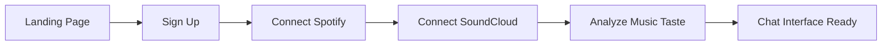

# Smart Mode MVP - Technical Product Requirements Document

## 1. Executive Summary

### Product Overview
Smart Mode is an AI-powered music mixtape generator with a chat-like interface where users create personalized playlists through natural language prompts. The MVP focuses on simplicity: connect Spotify/SoundCloud, chat with the AI DJ, and get perfect mixtapes.

### Core Value Proposition
- **Natural Language Mixtapes**: "Create a workout mix with high energy rap and electronic"
- **Context-Aware Playlists**: Understands mood, activity, time, and personal taste
- **Unified Music Library**: Combines Spotify and SoundCloud in one interface
- **Zero Learning Curve**: Chat interface like ChatGPT/Claude

### Tech Stack
- **Frontend**: Next.js 15, React 19, TypeScript 5
- **UI**: Shadcn/ui, Tailwind CSS v4, Radix UI
- **State Management**: Zustand + React Query (TanStack Query)
- **Auth**: NextAuth.js v5 with Spotify/SoundCloud OAuth
- **Backend**: Next.js API Routes + Edge Functions
- **Database**: PostgreSQL (Supabase/Neon) + Redis (Upstash)
- **AI**: OpenAI GPT-4 / Anthropic Claude for chat
- **Deployment**: Vercel Edge Network

## 2. User Journey & Features

### 2.1 Onboarding Flow



**Features:**
1. **Progressive Onboarding**
   - Start with just email/Google sign-in
   - Connect music services one by one
   - Skip option for SoundCloud if not used

2. **Music Taste Analysis**
   - Fetch user's top artists, tracks, playlists
   - Analyze listening history
   - Build initial taste profile
   - Show progress with loading animation

### 2.2 Main Chat Interface

**Core Features:**
1. **Chat Input**
   - Natural language prompt input
   - Suggested prompts/chips
   - Voice input option (Web Speech API)
   - Typing indicators while AI processes

2. **AI Responses**
   - Conversational responses explaining playlist creation
   - Interactive playlist cards
   - Inline playback controls
   - Feedback mechanisms (thumbs up/down)

3. **Playlist Generation**
   - Real-time playlist creation
   - Mix sources (Spotify + SoundCloud)
   - Smart track ordering
   - Duration/track count control

### 2.3 Example Prompts & Responses

```
User: "I need focus music for coding, mostly instrumental, 2 hours"

AI: "I'll create a 2-hour instrumental coding playlist for you! 
I'm mixing ambient electronic, lo-fi beats, and film scores - 
perfect for deep focus. Here's your 'Flow State' mixtape..."

[Generates 30-track playlist]
```

## 3. Technical Architecture

### 3.1 Project Structure

```
smart-mode/
├── app/                      # Next.js 15 App Router
│   ├── (auth)/              # Auth routes group
│   │   ├── login/
│   │   └── onboarding/
│   ├── (main)/              # Main app routes
│   │   ├── chat/            # Chat interface
│   │   └── library/         # User library view
│   ├── api/                 # API routes
│   │   ├── auth/[...nextauth]/
│   │   ├── spotify/
│   │   ├── soundcloud/
│   │   └── ai/
│   ├── layout.tsx
│   └── globals.css
├── components/
│   ├── ui/                  # Shadcn components
│   ├── chat/
│   │   ├── ChatInput.tsx
│   │   ├── ChatMessage.tsx
│   │   ├── PlaylistCard.tsx
│   │   └── SuggestedPrompts.tsx
│   ├── onboarding/
│   └── providers/
├── lib/
│   ├── auth/
│   ├── spotify/
│   ├── soundcloud/
│   ├── ai/
│   ├── db/
│   └── utils/
├── hooks/
├── types/
├── middleware.ts
└── next.config.js
```

### 3.2 Database Schema (PostgreSQL)

```sql
-- Users table
CREATE TABLE users (
  id UUID PRIMARY KEY DEFAULT gen_random_uuid(),
  email TEXT UNIQUE NOT NULL,
  name TEXT,
  avatar_url TEXT,
  created_at TIMESTAMPTZ DEFAULT NOW(),
  updated_at TIMESTAMPTZ DEFAULT NOW()
);

-- Music service connections
CREATE TABLE connections (
  id UUID PRIMARY KEY DEFAULT gen_random_uuid(),
  user_id UUID REFERENCES users(id) ON DELETE CASCADE,
  service TEXT NOT NULL, -- 'spotify' | 'soundcloud'
  access_token TEXT,
  refresh_token TEXT,
  expires_at TIMESTAMPTZ,
  service_user_id TEXT,
  created_at TIMESTAMPTZ DEFAULT NOW()
);

-- User music profile
CREATE TABLE music_profiles (
  id UUID PRIMARY KEY DEFAULT gen_random_uuid(),
  user_id UUID REFERENCES users(id) ON DELETE CASCADE,
  top_artists JSONB,
  top_tracks JSONB,
  top_genres JSONB,
  audio_features JSONB, -- avg energy, danceability, etc
  last_analyzed TIMESTAMPTZ,
  created_at TIMESTAMPTZ DEFAULT NOW()
);

-- Chat conversations
CREATE TABLE conversations (
  id UUID PRIMARY KEY DEFAULT gen_random_uuid(),
  user_id UUID REFERENCES users(id) ON DELETE CASCADE,
  title TEXT,
  created_at TIMESTAMPTZ DEFAULT NOW(),
  updated_at TIMESTAMPTZ DEFAULT NOW()
);

-- Chat messages
CREATE TABLE messages (
  id UUID PRIMARY KEY DEFAULT gen_random_uuid(),
  conversation_id UUID REFERENCES conversations(id) ON DELETE CASCADE,
  role TEXT NOT NULL, -- 'user' | 'assistant'
  content TEXT NOT NULL,
  playlist_data JSONB, -- generated playlist if applicable
  created_at TIMESTAMPTZ DEFAULT NOW()
);

-- Generated playlists
CREATE TABLE playlists (
  id UUID PRIMARY KEY DEFAULT gen_random_uuid(),
  user_id UUID REFERENCES users(id) ON DELETE CASCADE,
  message_id UUID REFERENCES messages(id),
  name TEXT NOT NULL,
  description TEXT,
  tracks JSONB NOT NULL,
  total_duration INTEGER, -- in seconds
  prompt TEXT,
  exported_to TEXT[], -- ['spotify', 'soundcloud']
  created_at TIMESTAMPTZ DEFAULT NOW()
);
```

## 4. Core Implementation Details

### 4.1 Authentication Setup (NextAuth.js)

```typescript
// app/api/auth/[...nextauth]/route.ts
import NextAuth from 'next-auth'
import SpotifyProvider from 'next-auth/providers/spotify'
import GoogleProvider from 'next-auth/providers/google'

const handler = NextAuth({
  providers: [
    GoogleProvider({
      clientId: process.env.GOOGLE_CLIENT_ID!,
      clientSecret: process.env.GOOGLE_CLIENT_SECRET!,
    }),
    SpotifyProvider({
      clientId: process.env.SPOTIFY_CLIENT_ID!,
      clientSecret: process.env.SPOTIFY_CLIENT_SECRET!,
      authorization: {
        params: {
          scope: 'user-read-email user-top-read user-library-read playlist-modify-public playlist-modify-private streaming user-read-playback-state user-modify-playback-state'
        }
      }
    })
  ],
  callbacks: {
    async jwt({ token, account }) {
      if (account) {
        token.accessToken = account.access_token
        token.refreshToken = account.refresh_token
        token.expiresAt = account.expires_at
      }
      return token
    },
    async session({ session, token }) {
      session.accessToken = token.accessToken
      return session
    }
  }
})

export { handler as GET, handler as POST }
```

### 4.2 Spotify Integration Service

```typescript
// lib/spotify/client.ts
export class SpotifyClient {
  private accessToken: string

  constructor(accessToken: string) {
    this.accessToken = accessToken
  }

  async getUserProfile() {
    const res = await fetch('https://api.spotify.com/v1/me', {
      headers: { Authorization: `Bearer ${this.accessToken}` }
    })
    return res.json()
  }

  async getTopArtists(limit = 50) {
    const res = await fetch(
      `https://api.spotify.com/v1/me/top/artists?limit=${limit}&time_range=medium_term`,
      { headers: { Authorization: `Bearer ${this.accessToken}` }}
    )
    return res.json()
  }

  async getTopTracks(limit = 50) {
    const res = await fetch(
      `https://api.spotify.com/v1/me/top/tracks?limit=${limit}&time_range=medium_term`,
      { headers: { Authorization: `Bearer ${this.accessToken}` }}
    )
    return res.json()
  }

  async getUserPlaylists(limit = 50) {
    const res = await fetch(
      `https://api.spotify.com/v1/me/playlists?limit=${limit}`,
      { headers: { Authorization: `Bearer ${this.accessToken}` }}
    )
    return res.json()
  }

  async searchTracks(query: string, limit = 20) {
    const res = await fetch(
      `https://api.spotify.com/v1/search?q=${encodeURIComponent(query)}&type=track&limit=${limit}`,
      { headers: { Authorization: `Bearer ${this.accessToken}` }}
    )
    return res.json()
  }

  async getRecommendations(params: RecommendationParams) {
    const queryParams = new URLSearchParams(params as any)
    const res = await fetch(
      `https://api.spotify.com/v1/recommendations?${queryParams}`,
      { headers: { Authorization: `Bearer ${this.accessToken}` }}
    )
    return res.json()
  }

  async createPlaylist(userId: string, name: string, description: string) {
    const res = await fetch(
      `https://api.spotify.com/v1/users/${userId}/playlists`,
      {
        method: 'POST',
        headers: {
          Authorization: `Bearer ${this.accessToken}`,
          'Content-Type': 'application/json'
        },
        body: JSON.stringify({ name, description, public: false })
      }
    )
    return res.json()
  }

  async addTracksToPlaylist(playlistId: string, trackUris: string[]) {
    const res = await fetch(
      `https://api.spotify.com/v1/playlists/${playlistId}/tracks`,
      {
        method: 'POST',
        headers: {
          Authorization: `Bearer ${this.accessToken}`,
          'Content-Type': 'application/json'
        },
        body: JSON.stringify({ uris: trackUris })
      }
    )
    return res.json()
  }
}
```

### 4.3 SoundCloud Integration Service

```typescript
// lib/soundcloud/client.ts
export class SoundCloudClient {
  private clientId: string
  private accessToken?: string

  constructor(clientId: string, accessToken?: string) {
    this.clientId = clientId
    this.accessToken = accessToken
  }

  async getUserProfile() {
    if (!this.accessToken) throw new Error('Access token required')
    const res = await fetch(
      'https://api.soundcloud.com/me',
      {
        headers: { 
          Authorization: `OAuth ${this.accessToken}`,
          Accept: 'application/json'
        }
      }
    )
    return res.json()
  }

  async getUserLikes(limit = 50) {
    if (!this.accessToken) throw new Error('Access token required')
    const res = await fetch(
      `https://api.soundcloud.com/me/likes?limit=${limit}`,
      {
        headers: { 
          Authorization: `OAuth ${this.accessToken}`,
          Accept: 'application/json'
        }
      }
    )
    return res.json()
  }

  async getUserFollowings() {
    if (!this.accessToken) throw new Error('Access token required')
    const res = await fetch(
      'https://api.soundcloud.com/me/followings',
      {
        headers: { 
          Authorization: `OAuth ${this.accessToken}`,
          Accept: 'application/json'
        }
      }
    )
    return res.json()
  }

  async searchTracks(query: string, limit = 20) {
    const params = new URLSearchParams({
      q: query,
      limit: limit.toString(),
      client_id: this.clientId
    })
    const res = await fetch(
      `https://api.soundcloud.com/tracks?${params}`,
      { headers: { Accept: 'application/json' }}
    )
    return res.json()
  }

  async getTrackDetails(trackId: string) {
    const res = await fetch(
      `https://api.soundcloud.com/tracks/${trackId}?client_id=${this.clientId}`,
      { headers: { Accept: 'application/json' }}
    )
    return res.json()
  }
}
```

### 4.4 AI Chat Service

```typescript
// lib/ai/chat-service.ts
import { OpenAI } from 'openai'

const openai = new OpenAI({
  apiKey: process.env.OPENAI_API_KEY
})

export interface MixtapeRequest {
  prompt: string
  userProfile: UserMusicProfile
  conversationHistory?: Message[]
}

export async function generateMixtape(request: MixtapeRequest) {
  const systemPrompt = `
You are an expert AI DJ that creates perfect mixtapes based on user requests.
You have access to the user's music taste profile and can search both Spotify and SoundCloud.

User Profile:
- Top Genres: ${request.userProfile.topGenres.join(', ')}
- Favorite Artists: ${request.userProfile.topArtists.slice(0, 10).join(', ')}
- Listening Characteristics: Energy ${request.userProfile.avgEnergy}, Danceability ${request.userProfile.avgDanceability}

When creating a mixtape:
1. Understand the user's request (mood, activity, duration, genre preferences)
2. Consider their music taste but also introduce discovery
3. Create a coherent flow with good transitions
4. Mix familiar favorites with new discoveries
5. Balance Spotify and SoundCloud sources when possible

Return a structured response with:
- Playlist name and description
- Explanation of your choices
- List of recommended tracks with reasoning
`

  const response = await openai.chat.completions.create({
    model: 'gpt-4-turbo-preview',
    messages: [
      { role: 'system', content: systemPrompt },
      ...(request.conversationHistory || []),
      { role: 'user', content: request.prompt }
    ],
    temperature: 0.8,
    functions: [{
      name: 'create_playlist',
      description: 'Create a music playlist based on user request',
      parameters: {
        type: 'object',
        properties: {
          name: { type: 'string', description: 'Playlist name' },
          description: { type: 'string', description: 'Playlist description' },
          explanation: { type: 'string', description: 'Explanation of choices' },
          searchQueries: {
            type: 'array',
            items: { type: 'string' },
            description: 'Search queries to find tracks'
          },
          moodTags: {
            type: 'array',
            items: { type: 'string' },
            description: 'Mood/genre tags for the playlist'
          },
          targetDuration: { type: 'number', description: 'Target duration in minutes' },
          energyProfile: { type: 'string', enum: ['ascending', 'descending', 'steady', 'variable'] }
        }
      }
    }],
    function_call: { name: 'create_playlist' }
  })

  return JSON.parse(response.choices[0].message.function_call.arguments)
}
```

### 4.5 Main Chat Component

```typescript
// components/chat/ChatInterface.tsx
'use client'

import { useState, useRef, useEffect } from 'react'
import { useChat } from 'ai/react'
import { Button } from '@/components/ui/button'
import { Input } from '@/components/ui/input'
import { Card } from '@/components/ui/card'
import { ScrollArea } from '@/components/ui/scroll-area'
import { Avatar } from '@/components/ui/avatar'
import { Loader2, Send, Music, Sparkles, Mic } from 'lucide-react'
import { PlaylistCard } from './PlaylistCard'
import { SuggestedPrompts } from './SuggestedPrompts'
import { cn } from '@/lib/utils'

export function ChatInterface() {
  const { messages, input, handleInputChange, handleSubmit, isLoading } = useChat({
    api: '/api/chat',
    onFinish: (message) => {
      // Handle playlist generation
      if (message.playlist) {
        generatePlaylist(message.playlist)
      }
    }
  })

  const scrollRef = useRef<HTMLDivElement>(null)
  const [isListening, setIsListening] = useState(false)

  useEffect(() => {
    scrollRef.current?.scrollIntoView({ behavior: 'smooth' })
  }, [messages])

  const handleVoiceInput = () => {
    if (!('webkitSpeechRecognition' in window)) {
      alert('Voice input not supported in your browser')
      return
    }

    const recognition = new (window as any).webkitSpeechRecognition()
    recognition.continuous = false
    recognition.interimResults = false

    recognition.onstart = () => setIsListening(true)
    recognition.onend = () => setIsListening(false)
    recognition.onresult = (event: any) => {
      const transcript = event.results[0][0].transcript
      handleInputChange({ target: { value: transcript } } as any)
    }

    recognition.start()
  }

  return (
    <div className="flex flex-col h-[100vh] max-w-4xl mx-auto">
      {/* Header */}
      <div className="flex items-center justify-between p-4 border-b">
        <div className="flex items-center gap-3">
          <div className="p-2 rounded-lg bg-gradient-to-br from-purple-600 to-pink-600">
            <Music className="w-6 h-6 text-white" />
          </div>
          <div>
            <h1 className="text-xl font-semibold">Smart Mode AI</h1>
            <p className="text-sm text-muted-foreground">Your personal AI DJ</p>
          </div>
        </div>
        <Button variant="ghost" size="icon">
          <Sparkles className="w-5 h-5" />
        </Button>
      </div>

      {/* Chat Messages */}
      <ScrollArea className="flex-1 p-4">
        <div className="space-y-4">
          {messages.length === 0 && (
            <div className="text-center py-12">
              <Music className="w-12 h-12 mx-auto mb-4 text-muted-foreground" />
              <h2 className="text-2xl font-semibold mb-2">
                Welcome to Smart Mode
              </h2>
              <p className="text-muted-foreground mb-8">
                Tell me what kind of music you want to hear
              </p>
              <SuggestedPrompts onSelect={handleInputChange} />
            </div>
          )}

          {messages.map((message) => (
            <div
              key={message.id}
              className={cn(
                'flex gap-3',
                message.role === 'user' ? 'justify-end' : 'justify-start'
              )}
            >
              {message.role === 'assistant' && (
                <Avatar className="w-8 h-8">
                  <div className="w-full h-full bg-gradient-to-br from-purple-600 to-pink-600 flex items-center justify-center">
                    <Music className="w-4 h-4 text-white" />
                  </div>
                </Avatar>
              )}

              <div
                className={cn(
                  'max-w-[80%] rounded-lg p-3',
                  message.role === 'user'
                    ? 'bg-primary text-primary-foreground'
                    : 'bg-muted'
                )}
              >
                <p className="whitespace-pre-wrap">{message.content}</p>
                
                {message.playlist && (
                  <PlaylistCard
                    playlist={message.playlist}
                    className="mt-4"
                  />
                )}
              </div>

              {message.role === 'user' && (
                <Avatar className="w-8 h-8">
                  <div className="w-full h-full bg-muted flex items-center justify-center">
                    <span className="text-sm font-medium">You</span>
                  </div>
                </Avatar>
              )}
            </div>
          ))}

          {isLoading && (
            <div className="flex gap-3">
              <Avatar className="w-8 h-8">
                <div className="w-full h-full bg-gradient-to-br from-purple-600 to-pink-600 flex items-center justify-center">
                  <Music className="w-4 h-4 text-white" />
                </div>
              </Avatar>
              <div className="bg-muted rounded-lg p-3">
                <Loader2 className="w-4 h-4 animate-spin" />
              </div>
            </div>
          )}

          <div ref={scrollRef} />
        </div>
      </ScrollArea>

      {/* Input Area */}
      <div className="border-t p-4">
        <form onSubmit={handleSubmit} className="flex gap-2">
          <Input
            value={input}
            onChange={handleInputChange}
            placeholder="Create a workout playlist with high energy..."
            className="flex-1"
            disabled={isLoading}
          />
          <Button
            type="button"
            size="icon"
            variant="ghost"
            onClick={handleVoiceInput}
            disabled={isLoading || isListening}
          >
            <Mic className={cn('w-5 h-5', isListening && 'text-red-500')} />
          </Button>
          <Button type="submit" disabled={isLoading || !input.trim()}>
            <Send className="w-5 h-5" />
          </Button>
        </form>
      </div>
    </div>
  )
}
```

## 5. Mobile-First Responsive Design

### 5.1 Responsive Layout System

```typescript
// components/layout/ResponsiveLayout.tsx
'use client'

import { cn } from '@/lib/utils'
import { useMediaQuery } from '@/hooks/use-media-query'

export function ResponsiveLayout({ children }: { children: React.ReactNode }) {
  const isMobile = useMediaQuery('(max-width: 768px)')
  const isTablet = useMediaQuery('(min-width: 768px) and (max-width: 1024px)')

  return (
    <div className={cn(
      'min-h-screen bg-background',
      isMobile && 'pb-20' // Space for mobile nav
    )}>
      {children}
      {isMobile && <MobileNavigation />}
    </div>
  )
}
```

### 5.2 Dark Mode Implementation

```typescript
// components/providers/theme-provider.tsx
'use client'

import { ThemeProvider as NextThemesProvider } from 'next-themes'

export function ThemeProvider({ children }: { children: React.ReactNode }) {
  return (
    <NextThemesProvider
      attribute="class"
      defaultTheme="system"
      enableSystem
      disableTransitionOnChange
    >
      {children}
    </NextThemesProvider>
  )
}

// app/globals.css
@layer base {
  :root {
    --background: 0 0% 100%;
    --foreground: 222.2 84% 4.9%;
    /* ... other light theme variables */
  }

  .dark {
    --background: 222.2 84% 4.9%;
    --foreground: 210 40% 98%;
    /* ... other dark theme variables */
  }
}
```

## 6. Environment Variables

```bash
# .env.local

# Database
DATABASE_URL="postgresql://..."
REDIS_URL="redis://..."

# Auth
NEXTAUTH_URL="http://localhost:3000"
NEXTAUTH_SECRET="generate-with-openssl"

# Spotify API
SPOTIFY_CLIENT_ID=""
SPOTIFY_CLIENT_SECRET=""
SPOTIFY_REDIRECT_URI="http://localhost:3000/api/auth/callback/spotify"

# SoundCloud API
SOUNDCLOUD_CLIENT_ID=""
SOUNDCLOUD_CLIENT_SECRET=""
SOUNDCLOUD_REDIRECT_URI="http://localhost:3000/api/auth/callback/soundcloud"

# AI
OPENAI_API_KEY=""
# OR
ANTHROPIC_API_KEY=""

# Analytics (optional)
POSTHOG_KEY=""
SENTRY_DSN=""
```

## 7. Setup Instructions for Claude Code

### 7.1 Initial Setup Commands

```bash
# Create Next.js project with all options
npx create-next-app@latest smart-mode --typescript --tailwind --eslint --app --src-dir=false --import-alias="@/*"

# Navigate to project
cd smart-mode

# Install core dependencies
npm install @tanstack/react-query zustand axios
npm install next-auth @auth/prisma-adapter
npm install @radix-ui/react-avatar @radix-ui/react-dialog @radix-ui/react-scroll-area
npm install class-variance-authority clsx tailwind-merge
npm install lucide-react
npm install next-themes
npm install ai openai

# Install dev dependencies
npm install -D @types/node

# Initialize Shadcn UI
npx shadcn@latest init -d

# Add Shadcn components
npx shadcn@latest add avatar button card dialog input scroll-area tabs toast
```

### 7.2 Database Setup

```bash
# Install Prisma
npm install prisma @prisma/client

# Initialize Prisma
npx prisma init

# After updating schema.prisma, run:
npx prisma generate
npx prisma db push
```

### 7.3 File Creation Order

1. **Environment Setup**
   - Create `.env.local` with all API keys
   - Update `next.config.js` for API domains

2. **Layout & Providers**
   - `app/layout.tsx` - Root layout with providers
   - `components/providers/theme-provider.tsx`
   - `components/providers/query-provider.tsx`

3. **Auth Setup**
   - `app/api/auth/[...nextauth]/route.ts`
   - `lib/auth/config.ts`
   - `middleware.ts` for protected routes

4. **Onboarding Flow**
   - `app/(auth)/login/page.tsx`
   - `app/(auth)/onboarding/page.tsx`
   - `components/onboarding/SpotifyConnect.tsx`
   - `components/onboarding/SoundCloudConnect.tsx`

5. **Main Chat Interface**
   - `app/(main)/chat/page.tsx`
   - `components/chat/ChatInterface.tsx`
   - `components/chat/ChatMessage.tsx`
   - `components/chat/PlaylistCard.tsx`

6. **API Integration**
   - `lib/spotify/client.ts`
   - `lib/soundcloud/client.ts`
   - `lib/ai/chat-service.ts`
   - `app/api/chat/route.ts`

## 8. Testing & Quality Assurance

### 8.1 Core Test Scenarios

1. **Onboarding Flow**
   - New user signup
   - Spotify OAuth connection
   - SoundCloud OAuth connection
   - Music taste analysis completion

2. **Chat Functionality**
   - Send text prompt
   - Receive AI response
   - Generate playlist
   - Voice input

3. **Playlist Generation**
   - Various prompt types (mood, activity, genre)
   - Mixed source playlists
   - Export to Spotify
   - Playback controls

### 8.2 Performance Targets

- **Initial Load**: < 2s on 4G
- **Chat Response**: < 3s for AI response
- **Playlist Generation**: < 5s for 30 tracks
- **Lighthouse Score**: > 90 for mobile

## 9. Deployment Checklist

- [ ] Environment variables configured in Vercel
- [ ] Database migrations run
- [ ] OAuth redirect URLs updated for production
- [ ] API rate limiting configured
- [ ] Error tracking (Sentry) setup
- [ ] Analytics (PostHog/Mixpanel) configured
- [ ] SSL certificates verified
- [ ] CORS policies configured
- [ ] Security headers implemented
- [ ] Backup strategy in place

## 10. MVP Success Metrics

- **User Activation**: 60% complete onboarding
- **Engagement**: 3+ playlists generated per user
- **Retention**: 40% return after 7 days
- **Performance**: < 5% error rate
- **Satisfaction**: 4+ star average rating

## 11. Post-MVP Roadmap

### Phase 2 (Month 2-3)
- Apple Music integration
- Collaborative playlists
- Social sharing features
- Advanced voice commands

### Phase 3 (Month 4-6)
- Smart Mode (automatic context detection)
- Mobile apps (React Native)
- Offline mode
- Premium subscription tiers

## Appendix A: Component Examples

### A.1 Suggested Prompts Component

```typescript
// components/chat/SuggestedPrompts.tsx
const prompts = [
  "🏃 High energy workout mix",
  "🧘 Meditation and relaxation",
  "🎯 Deep focus for work",
  "🚗 Road trip classics",
  "😴 Sleep time ambient",
  "🎉 Friday night party",
]

export function SuggestedPrompts({ onSelect }: { onSelect: (value: string) => void }) {
  return (
    <div className="flex flex-wrap gap-2 justify-center">
      {prompts.map((prompt) => (
        <Button
          key={prompt}
          variant="outline"
          size="sm"
          onClick={() => onSelect(prompt)}
          className="text-sm"
        >
          {prompt}
        </Button>
      ))}
    </div>
  )
}
```

### A.2 Playlist Card Component

```typescript
// components/chat/PlaylistCard.tsx
export function PlaylistCard({ playlist }: { playlist: Playlist }) {
  return (
    <Card className="w-full">
      <CardHeader>
        <CardTitle>{playlist.name}</CardTitle>
        <CardDescription>{playlist.description}</CardDescription>
      </CardHeader>
      <CardContent>
        <div className="space-y-2">
          {playlist.tracks.slice(0, 5).map((track) => (
            <TrackItem key={track.id} track={track} />
          ))}
        </div>
        {playlist.tracks.length > 5 && (
          <p className="text-sm text-muted-foreground mt-2">
            +{playlist.tracks.length - 5} more tracks
          </p>
        )}
      </CardContent>
      <CardFooter className="flex justify-between">
        <Button size="sm">Play Now</Button>
        <Button size="sm" variant="outline">Export to Spotify</Button>
      </CardFooter>
    </Card>
  )
}
```

---

This PRD provides everything needed to build the MVP. Start with the authentication and onboarding flow, then implement the chat interface, and finally add the music service integrations. The architecture is scalable and follows Next.js 15 best practices with mobile-first responsive design.